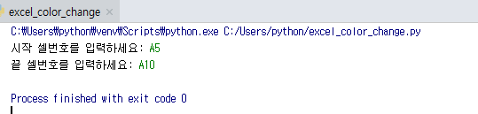
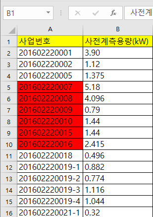

# ● 엑셀파일 셀 색상 변경하기
## 프로그램 설명
> **기존 엑셀파일에서 변경하고싶은 구간을 입력받아서 그 구간의 색상을 변경한다**

## 
#### #openpyxl 모듈, PatternFill, Color함수 임포트

    import openpyxl
    from openpyxl.styles import PatternFill, Color

> openpyxl 사용을 위해 모듈을 임포트한다
>
> Cell의 색상값을 적용하기위해서 PatternFill, Color클래스를 임포트한다
>
> 참조 : http://openpyxl.readthedocs.io/en/stable/api/openpyxl.styles.fills.html?highlight=styles%20fills%20patternfill

#### -----------------------------------------------------------------------------------------------------------------

    if __name__ == '__main__':

> 그 파일을 직접 호출할 때에만 프로그램이 작동될 수 있도록 써줌

#### -----------------------------------------------------------------------------------------------------------------
   
        excel_file = openpyxl.load_workbook("test_in.xlsx")
        sheet = excel_file['Sheet1']                             

> load_workbook <-- 엑셀 문서를 여는 데 필요한 메서드 
>
> 저장된 '**test_in.xlsx**'이라는 엑셀 파일을 데이터에 로드하여 변수 **excel_file**에 저장한다
>
> 읽고 쓰기 작업을 원하는 시트이름(**Sheet1**)을 변수 **sheet**에 대입해준다
>
> 참조 Link: https://bitbucket.org/openpyxl/openpyxl/src/7e42546674ebeb0e518d1a058abbb1a6d6f7fd1c/openpyxl/__init__.py?at=default&fileviewer=file-view-default

#### -----------------------------------------------------------------------------------------------------------------

        a = input("시작 셀번호를 입력하세요: ")
        b = input("끝 셀번호를 입력하세요: ")
       
> 바꿀 범위를 사용자에게 입력받아 변수 a,b에 저장
>

#### -----------------------------------------------------------------------------------------------------------------

        cell_range = sheet[a:b]
        
> 범위를 저장한 변수 a,b범위를 변수 **cell_range**에 저장

#### -----------------------------------------------------------------------------------------------------------------
        
        for row in cell_range:
            for cell in row:
                cell.fill = PatternFill(patternType='solid',fgColor=Color('FF0000'))
                
> 입력받은 범위에 대하여 컬러를 변경해준다.
>
> style.fills.fill 모듈 참조 : http://openpyxl.readthedocs.io/en/stable/api/openpyxl.styles.fills.html?highlight=styles.fill
>
> 'solid' - (색깔이) 다른 색깔이 섞이지 않은[완전한]
>
> 컬러코드 참조 : http://www.hipenpal.com/tool/html-color-charts-rgb-color-table-in-korean.php

#### -----------------------------------------------------------------------------------------------------------------

        excel_file.save("test_in_color.xlsx")

> 오픈된 엑셀파일을 저장함
>
> 변수.save <-- 현재 오픈된 엑셀파일을 저장
>
> 변수.save('파일이름.xlsx') <-- 새로운 엑셀파일을 만들면서 저장

## 프로그램 실행결과
> excel_color_change.py 실행 결과
>
>
>
> excel_color_change.py 실행후 색상 변경되어 만들어진 test_in.xlsx파일 
>
>
