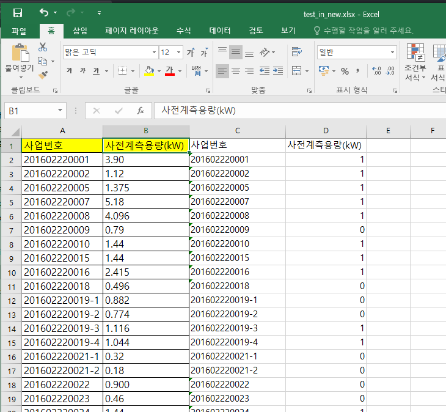
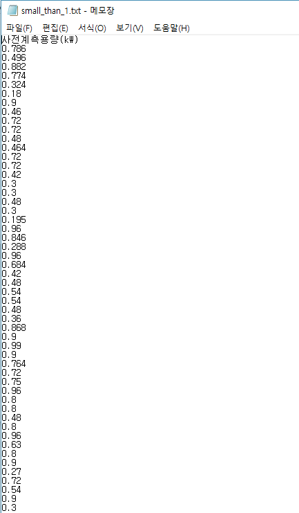
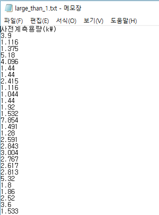

# 엑셀파일 - 조건에 따른 값을 새로운 외부파일로 만들기
## 프로그램 설명
> 데이터 값을 조건에 따라서 1보다 큰값만 적힌것과 작은값만 적힌 새로운 txt파일로 만들기

#### -----------------------------------------------------------------------------------------------------------------

    import openpyxl

> openpyxl 사용을 위해 모듈을 임포트한다  

    if __name__ == '__main__':

> 그 파일을 직접 호출할 때에만 프로그램이 작동될 수 있도록 써줌

#### -----------------------------------------------------------------------------------------------------------------

        file1 = open("small_than_1.txt", 'w')
        file2 = open("large_than_1.txt", 'w')
        
>> 새로운 외부 파일을 만들고 오픈한다
> 
> f = open("새파일이름.파일형식", 'w')
> 
> r	읽기모드 - 파일을 읽기만 할 때 사용
> 
> w	쓰기모드 - 파일에 내용을 쓸 때 사용
> 
> a	추가모드 - 파일의 마지막에 새로운 내용을 추가 시킬 때 사용
>
> 참조 : https://wikidocs.net/26        

#### -----------------------------------------------------------------------------------------------------------------

        excel_file = openpyxl.load_workbook('test_in.xlsx')

> load_workbook <-- 엑셀 문서를 여는 데 필요한 메서드 
>
> 저장된 '**test_in.xlsx**'이라는 엑셀 파일을 데이터에 로드하여 변수 **excel_file**에 저장한다
>
> 참조 Link: https://bitbucket.org/openpyxl/openpyxl/src/7e42546674ebeb0e518d1a058abbb1a6d6f7fd1c/openpyxl/__init__.py?at=default&fileviewer=file-view-default

        sheet = excel_file['Sheet1']
        
> 읽고 쓰기 작업을 원하는 시트이름(**Sheet1**)을 변수 **sheet**에 대입해준다    
        

#### -----------------------------------------------------------------------------------------------------------------

        all_rows = sheet.rows

> rows() 메서드는 데이터가 입력되있는 모든 열에 대하여 변수에 저장하는 것이다
>
> **변수 = 시트변수.rows** 형태로 쓰이며 열영역별로 변수에 저장한다

#### -----------------------------------------------------------------------------------------------------------------

        row_num = 0
        
> 밑에 for문 안에서 행값을 증가시켜 주기 위한 변수를 선언하고 초기화한다
        
        small = list()
        large = list()
        
> 사용자에게 입력받은 데이터를 외부파일에 저장하기 위하여 비어있는 리스트를 만든다
>
> 2개의 파일을 만들기 위해 2개의 변수를 사용하여 비어있는 리스트를 만듦
        
#### -----------------------------------------------------------------------------------------------------------------

        for row in all_rows:
            row_num += 1
            sheet.cell(row = row_num, column = 3, value = str(row[0].value))
            
> 먼저 A행의 값들을 C행에 그대로 쓰기
>
> **작업시트변수.cell(row = 행번호, column = 열번호, value = 대입값)** <-- 지정한 행번호와 열번호에 대입값을 입력하는 메서드
> 
> row[0]로 써준것은 row가 튜플로 되있기 때문에 한가지 행만 슬라이싱 하기위한것
>
> str(row[0].value) 대입값을 string으로 한 이유는 원래값이 기호가 없고 숫자로만 되있고 매우 길경우 지수형태로 표시되기 때문            
            
            if row_num == 1:
                sheet.cell(row=row_num, column=4, value=row[1].value)
                list_name = row[1].value
                
> B행의 첫번째 열은 string(문자열) 형식이므로 조건문에서 숫자로 판단할 수 없다 따라서 그대로 D행에 대입해준다                
>
> 변수 **list_name**에 첫줄값 그대로 대입
                
            else:
                if row[1].value == None :
                    sheet.cell(row = row_num, column = 4, value = None)
                    
> B행 2번째 열부터 조건문 판단, 만약 값이 비어있으면 빈칸으로 비워둠
                    
                elif row[1].value < 1:
                    small.append(row[1].value)
                    sheet.cell(row=row_num, column=4, value=0)
                    
> 만약 1보다 작을 경우 0대입
>
> 1보다 작은 경우 B행의 원래의 값들을 리스트 **small**에 저장
                    
                else :
                    large.append(row[1].value)
                    sheet.cell(row = row_num, column = 4, value = 1)
                    
> 값이 비어있지 않고 1 보다 클경우 1대입
>
> 1보다 큰 경우 B행의 원래의 값들을 리스트 **large**에 저장

#### -----------------------------------------------------------------------------------------------------------------

        file1.write('%s\n'% list_name)    
        file2.write('%s\n'% list_name)
        
> 첫줄은 제목이므로 그대로 외부파일에 써준다        

#### -----------------------------------------------------------------------------------------------------------------

        #파일1쓰기
        for s1 in small:
            data1 = "%s\n" % s1
            file1.write(data1)
            
> 위에서 조건에 따라서 분류되어 1보다 작은 값들이 들어있는 리스트**small**에 저장된 데이터값을 외부파일에 써준다

#### -----------------------------------------------------------------------------------------------------------------

        #파일2 쓰기
        for l1 in large:
            data2 = "%s\n" % l1
            file2.write(data2)
            
> 위에서 조건에 따라서 분류되어 1보다 큰 값들이 들어있는 리스트**large**에 저장된 데이터값을 외부파일에 써준다            
            
#### -----------------------------------------------------------------------------------------------------------------            

        file1.close()
        file2.close()
        
> 외부파일 file1, file2를 저장하고 닫는다        

#### -----------------------------------------------------------------------------------------------------------------

        excel_file.save("test_in_new.xlsx")
        
> 오픈된 엑셀파일을 저장함
>
> 변수.save <-- 현재 오픈된 엑셀파일을 저장
>
> 변수.save('파일이름.xlsx') <-- 새로운 엑셀파일을 만들면서 저장        

## 프로그램 실행결과
> * excel_create_DataFile.py 실행결과 만들어진 test_in_new.xlsx 파일
>
>
>
> * excel_create_DataFile.py 실행결과 만들어진 small.txt 파일
>
>
>
> * excel_create_DataFile.py 실행결과 만들어진 small.txt 파일
>
>

        
        
