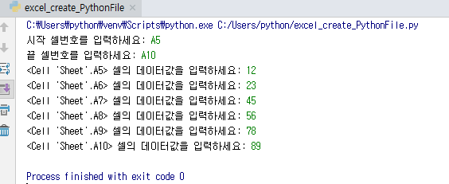

# ● 엑셀파일 - 파일생성
## 프로그램 설명
> 사용자에게 데이터 입력받아 새로운 excel파일과 python파일 생성한다.

#### -----------------------------------------------------------------------------------------------------------------

    import openpyxl
    from openpyxl import Workbook
    
> openpyxl 사용을 위해 모듈을 임포트한다    

#### -----------------------------------------------------------------------------------------------------------------

    if __name__ == '__main__':
    
> 그 파일을 직접 호출할 때에만 프로그램이 작동될 수 있도록 써줌

        excel_file = Workbook()
        
> Workbook() <-- 새로운 워크시트를 만들어 로드한다.        
        
        sheet = excel_file.active
        
> .active <-- 현재 로드된 엑셀파일의 시트를 사용한다는 것        
        
        file = open("ABC.py", 'w')

> 새로운 외부 파일을 만들고 오픈한다
> 
> f = open("새파일이름.파일형식", 'w')
> 
> r	읽기모드 - 파일을 읽기만 할 때 사용
> 
> w	쓰기모드 - 파일에 내용을 쓸 때 사용
> 
> a	추가모드 - 파일의 마지막에 새로운 내용을 추가 시킬 때 사용
>
> 참조 : https://wikidocs.net/26

#### -----------------------------------------------------------------------------------------------------------------

        a = input("시작 셀번호를 입력하세요: ")
        b = input("끝 셀번호를 입력하세요: ")
        cell_range = sheet[a:b]
        
> 바꿀 범위를 사용자에게 입력받아 변수 a,b에 저장
>
> 변수 a,b에 저장한 데이터 범위를 변수 **cell_range**에 저장

#### -----------------------------------------------------------------------------------------------------------------

        d = list()

> 사용자에게 입력받은 데이터를 외부파일에 저장하기 위하여 비어있는 리스트를 만든다
        

        for row in cell_range:
            for cell in row:
                c = input("%s 셀의 데이터값을 입력하세요: " %cell)
                cell.value = c
                d.append(c)

> 사용자에게 입력받은 데이터 범위의 각 셀에 데이터를 입력받아서 cell.value에 저장하고 리스트**d**에 값을하나씩 저장

#### -----------------------------------------------------------------------------------------------------------------

        data1 = '''if __name__ == "__main__":
        a = list() 
        '''
        file.write("%s\n"%data1)

> 외부파일을 파이썬형식의 파일로 저장하기 때문에 외부파일도 작동될 수 있도록 코드 입력해준다

#### -----------------------------------------------------------------------------------------------------------------

        for e in d:
            data2 = "    a.append('%s')\n" % e
            file.write(data2)
            
> 위에서 사용자에게 데이터값을 입력받아 만든 리스트**d**의 데이터값을 외부파일에 써준다

#### -----------------------------------------------------------------------------------------------------------------

        data3 = "    print(a)"
        file.write(data3)
        
> 마지막으로 외부 파이썬파일에서 저장된 데이터 값의 리스트를 출력해주기 위하여 print문을 써준다

#### -----------------------------------------------------------------------------------------------------------------

        file.close()
        
> 외부 생성파일을 저장하고 닫는다        

#### -----------------------------------------------------------------------------------------------------------------

        excel_file.save("sample.xlsx")
        
> 오픈된 엑셀파일을 저장함
>
> 변수.save <-- 현재 오픈된 엑셀파일을 저장
>
> 변수.save('파일이름.xlsx') <-- 새로운 엑셀파일을 만들면서 저장

## 프로그램 실행결과
> * excel_create_PythonFile.py 실행결과
>
>
>
> * excel_create_PythonFile.py 실행결과 만들어진 sample.xlsx파일
>
>
>
> * excel_create_PythonFile.py 실행결과 만들어진 ABC.py파일
>
>
>
> * ABC.py 실행결과
>
>

