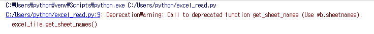
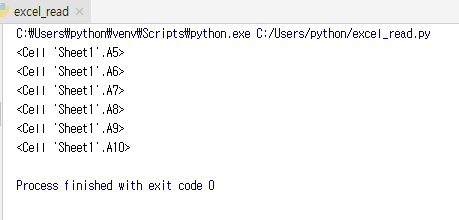

# ● 엑셀파일 오픈하고 읽기

## ● A5 ~ A10까지 데이터를 읽고 출력해주는 프로그램

#### #openpyxl 모듈을 임포트
    import openpyxl

> openpyxl 사용을 위해 모듈을 임포트한다
>
> 다운로드 방법 참조 : https://github.com/jeonghoonkang/keti/blob/master/BootCamp/cschai/openpyxl/openpyxl_directions.md

#### #test_in.xlsx파일 열기  
    excel_file = openpyxl.load_workbook('test_in.xlsx')   

> load_workbook <-- 엑셀 문서를 여는 데 필요한 메서드  
>
> 저장된 '**test_in.xlsx**'이라는 엑셀 파일을 데이터에 로드하여 변수 **excel_file**에 저장한다
>
> 참조 Link: https://bitbucket.org/openpyxl/openpyxl/src/7e42546674ebeb0e518d1a058abbb1a6d6f7fd1c/openpyxl/__init__.py?at=default&fileviewer=file-view-default

#### #해당 excel파일의 모든 시트이름 출력
    print(excel_file.sheetnames)                             

> 오픈한 엑셀파일의 시트이름 전부를 출력해주는 명령어
>
> excel_file.get_sheet_names()  <- 앞으로 더이상 쓰이지 않기때문에 에러가 남 
>
> 
>
> 따라서 print(excel_file.sheetnames)로 사용
>
> 다른 쓰이지 않는 메서드들 참조 http://openpyxl.readthedocs.io/en/stable/api/openpyxl.workbook.workbook.html?highlight=get_sheet_names

#### #작업을 원하는 시트 지정
    sheet = excel_file['Sheet1']            
    
> 읽고 쓰기 작업을 원하는 시트이름(**Sheet1**)을 변수 **sheet**에 대입해준다

#### #cell의 범위 지정

    cell_range = sheet['A5':'A10']                          

> 읽어들일 셀 번호 **시트이름 저장변수['시작 셀번호' : '끝 셀번호']** 를 변수 **cell_range**에 저장

#### #셀값 출력 
    for row in cell_range:

        for cell in row:
        
            print(cell.value)                                 
  
> 지정한 셀 범위에 해당하는 셀값들을 하나씩 출력해준다
>
> print(변수.value)는 하나의 셀의 값을 출력해주는 명령어
>
> print(변수) 이렇게만 입력하면 셀의 값이 아니라 해당 셀의 번호를 출력해준다
>
> 

