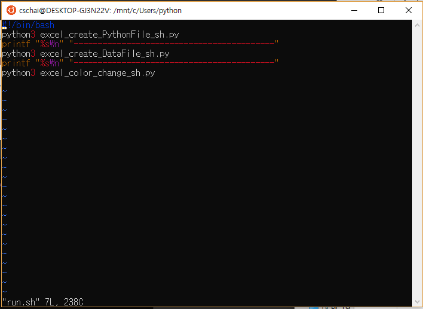
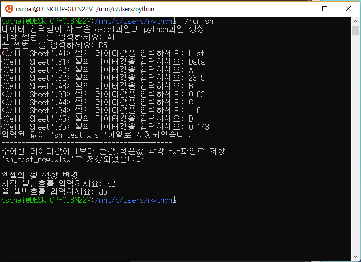
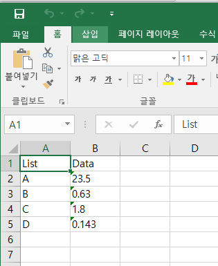
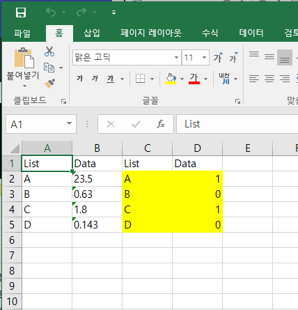

# ● run.sh
## 프로그램
> **셸 스크립트를 이용하여 각각의 기능을 하는 파이썬 파일을 합쳐 한번에 구동할 수 있도록함**
#### -----------------------------------------------------------------------------------------------------------------
## 셸 스크립트 설명
### #1.셸 스크립트(Shell script)
셸 스크립트(shell script)는 셸이나 명령 줄 인터프리터에서 돌아가도록 작성되었거나 한 운영 체제를 위해 쓰인 스크립트이다. 단순한 도메인 고유 언어로 여기기도 한다. 셸 스크립트가 수행하는 일반 기능으로는 파일 이용, 프로그램 실행, 문자열 출력 등이 있다

### #2.셸 스크립트의 종류
(1) 본 셸 (Bourne Shell)​
 - 개발자 스티븐 본(Stephen Bourne)의 이름에서 유래​
 - 유닉스 v7에 포함된 최초의 셸​
 - 오랫동안 UNIX시스템의 표준 구성요소였으나, 후에 개발된 여러 쉘에 비해 기능적인 면이 부족함​
 - 본 셸의 명령 이름은 sh (/bin/sh)​

(2) C 셸 (C Shell)​
 - 캘리포니아 대학교(버클리)에서 빌 조이가 개발​
 - 28SD 유닉스에 포함되어 발표됨​
 - 본 셸과 호환이 되지만 인터페이스 구조가 다르고, 셸 스크립트의 작성 구문 형식이 C언어와 같음​
 - 명령 이름은 csh (/bin/csh)​

(3) 콘 셸 (Korn Shell)​
 - 유닉스 SVR4에 포함되어 발표됨​
 - 1980년대 중반 AT&T 벨 연구소의 데이비드 콘이 개발​
 - 명령 이름은 ksh (/bin/ksh)​

(4) 배시 셸 (Bash Shell)​
 - 1988년 본 셸을 기반으로 브레인 폭스가 개발​
 - 본 셸과의 호환성을 유지하며 C 셸과 콘 셸의 편리한 기능도 포함​
 - 배시 셸은 GPL을 따르는 공개 소프트웨어로서 자유롭게 이용 가능​
 - 명령 이름은 bash(/bin/bash)​

(5) 대시 셸​
 - 암키스트 셸의 NetBSD 버전으로 1997년 초 허버트 슈가 리눅스에 이식,​
   2002년 dash로 이름이 바뀜​
 - 본 셸을 기반으로 개발된 셸로서 포직스(POSIX) 표준을 준수하며 보다 작은 크기로 개발된 셸​
 - 명령 이름은 dash(/bin/dash)​
 - 우분투는 6.10버젼부터 시스템 기본 셸로 사용하기에 /bin/sh 로 사용 가능
 
>[출처] : https://blog.naver.com/yonery9/221262270460

### #3.셸 스크립트모드
1) 명령 모드(command mode) 
 - 처음 vi 명령어로 vi를 시작하게 되면 들어가는 모드. 여기서는 방향키를 이용하여 커서를 이동할 수 있으며, 한 줄 삭제 및 한 줄 붙여넣기, 또는 글자 하나를 삭제할 수 있음. 

2) 입력 모드(insert mode) 
 - 명령모드에서 "i" 나 "a" 명령을 통해서 입력 모드로 넘어 갈 수있음. 입력모드로 가게되면, 자유롭게 코드나 글을 작성가능.
 명령 모드로 다시 돌아오려면 "ESC"입력.  ("i" 명령은 커서가 현재 위치한 부분에서 부터, "a"는 커서 바로 다음 부분부터)

3) 마지막 행 모드(Last line mode) 
 - 마지막행 모드는 명령모드에서 ":" (콜론) 을 입력하면 화면 맨 밑단에 :______ 하며 입력을 할수 있는 공간이 나옴. 
 여기서 현재까지 내가 작성한 이 내용을 저장하고 vi를 종료(wq)할지, 그냥 종료(q, q!)할지 등을 입력가능.

명령어 참조
> 참조 : http://blockdmask.tistory.com/25

#### -----------------------------------------------------------------------------------------------------------------
### #프로그램 설명

> run.sh의 코드에는 excel_create_DataFile_sh.py, excel_create_PythonFile_sh.py, excel_color_change_sh.py이 순차적으로 실행되게끔 작성됨.

> excel_create_DataFile_sh.py은 사용자가 데이터를 입력하여 엑셀파일로 작성되고 입력한 값들이 새로운 파이썬 파일에 배열형식으로 입력되어 생성되는 파일이다.

> excel_create_PythonFile_sh.py는 사용자가 입력한 데이터값이 1보다 작으면 모두0으로, 1보다 크면 1로 데이터 값이 변환되어 새로운 열에 써지고 1과 0으로 변환되는 값들이 써진 파일을 각각 만드는 파일이다.

> excel_color_change_sh.py는 사용자가 범위를 입력하면 그 범위에 해당하는 셀의 색상이 변경되는 파일이다.

> run.sh는 세 개의 파일이 순차적으로 실행되어 각각의 기능을 한번에 사용할 수 있는 파일이다.

#### -----------------------------------------------------------------------------------------------------------------
## 프로그램 실행결과
> ○ run.sh 코드
>
>
>
> ○ run.sh 실행결과
>
>
>
> ○ run.sh 실행후 사용자가 입력한 데이터값으로 생성된 sh_test.xlsx파일
>
>
>
> ○ run.sh 실행후 1,0으로 구분되고 셀 색상 변경된 sh_test_new.xlsx파일
>
>
