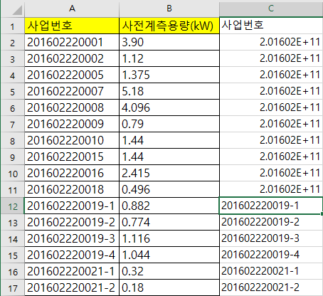
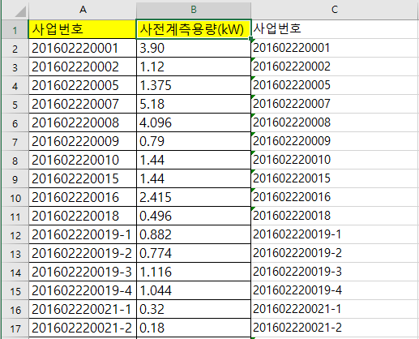

# ● 엑셀파일 읽고 쓰기
## 프로그램 설명
> **A행의 값들을 C행으로 그대로 복사해서 쓰고 B행의 값들은 1보다 작으면 0으로, 1보다 크거가 같으면 1로 D행에 쓰기**

#### #openpyxl 모듈을 임포트
    import openpyxl

> openpyxl 사용을 위해 모듈을 임포트한다
>
> 다운로드 방법 참조 : https://github.com/jeonghoonkang/keti/blob/master/BootCamp/cschai/openpyxl/openpyxl_directions.md

#### #test_in.xlsx파일 열기  
    excel_file = openpyxl.load_workbook('test_in.xlsx')   
 
> load_workbook <-- 엑셀 문서를 여는 데 필요한 메서드 
>
> 저장된 '**test_in.xlsx**'이라는 엑셀 파일을 데이터에 로드하여 변수 **excel_file**에 저장한다
>
> 참조 Link: https://bitbucket.org/openpyxl/openpyxl/src/7e42546674ebeb0e518d1a058abbb1a6d6f7fd1c/openpyxl/__init__.py?at=default&fileviewer=file-view-default

#### #작업을 원하는 시트 지정
    sheet = excel_file['Sheet1']            
    
> 읽고 쓰기 작업을 원하는 시트이름(**Sheet1**)을 변수 **sheet**에 대입해준다

#### #모든 열
    all_rows = sheet.rows
> rows() 메서드는 데이터가 입력되있는 모든 열에 대하여 변수에 저장하는 것이다
>
> **변수 = 시트변수.rows** 형태로 쓰이며 열영역별로 변수에 저장한다

#### #변수 초기화
    row_num = 0
> 밑에 for문 안에서 행값을 증가시켜 주기 위한 변수를 선언하고 초기화한다

#### 데이터값 쓰기
    for row in all_rows:

        row_num += 1
> 행의 값을 하나씩 증가시켜 준다

#### --
        sheet.cell(row = row_num, column = 3, value = str(row[0].value))
> 먼저 A행의 값들을 C행에 그대로 쓰기
>
> **작업시트변수.cell(row = 행번호, column = 열번호, value = 대입값)** <-- 지정한 행번호와 열번호에 대입값을 입력하는 메서드
> 
> row[0]로 써준것은 row가 튜플로 되있기 때문에 한가지 행만 슬라이싱 하기위한것
>
> str(row[0].value) 대입값을 string으로 한 이유는 원래값이 기호가 없고 숫자로만 되있고 매우 길경우 지수형태로 표시되기 때문
> 
> row[0].value로 써줬을 경우
>
> 
>
> A2 ~ A11까지 기호없이 숫자로만 되있고 길이가 길어서 C2~C11에 지수형태로 대입되었음
>
> str(row[0].value)로 써줬을 경우
> 
> 
>
> 문자열 형태로 대입되기 때문에 그대로 표시됌

#### --
        if row_num == 1:

            sheet.cell(row=row_num, column=4, value=row[1].value)
            
> B행의 첫번째 열은 string(문자열) 형식이므로 조건문에서 숫자로 판단할 수 없다
>
> 따라서 그대로 D행에 대입해준다

        else:
    
            if row[1].value == None :
        
                sheet.cell(row = row_num, column = 4, value = None)
                
> B행 2번째 열부터 조건문 판단
>
> 만약 값이 비어있으면 빈칸으로 비워둠

            elif row[1].value < 1:
        
                sheet.cell(row=row_num, column=4, value=0)
                
> 만약 1보다 작을 경우 0대입

            else :
        
                sheet.cell(row = row_num, column = 4, value = 1)
                
> 값이 비어있지 않고 1 보다 클경우 1대입
         
         
#### #저장
    excel_file.save("test_in_new.xlsx")
> 오픈된 엑셀파일을 저장함
>
> 변수.save <-- 현재 오픈된 엑셀파일을 저장
>
> 변수.save('파일이름.xlsx') <-- 새로운 엑셀파일을 만들면서 저장
