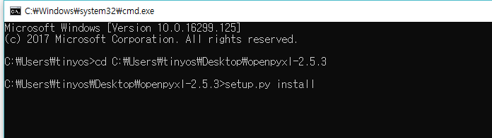

# openpyxl 사용
### ● openpyxl 다운로드
1. https://pypi.python.org/pypi/openpyxl 접속

2. 오른쪽 상단에 다운로드 클릭

3. 다운로드 후 압축해제

4. 원도우 + R키 누른후 cmd를 입력하여 명령 프롬프트창 실행  

5. cmd창에서 cd C:\(oenpyxl-2.5.3이 들어있는 파일 경로) 입력

6. cmd창에서 python setup.py install 입력

### ● openpyxl 기본 함수들
> load_workbook : 엑셀파일 열기

> create_sheet : 시트 추가

> cell : 시트에서 행, 열을 선택하여 값을 넣음

> wb = Workbook()                        # 워크북을 생성한다.

> ws = wb.active                         # 워크 시트를 얻는다.

> ws['A1'] = 'Hello'                      # A1에 'Hello' 값을 입력한다.

> wb.save('파일 이름.xlsx')                 # 엑셀로 저장한다.
 

### ● 엑셀파일에 자료입력하고 새로 만들기

	from openpyxl import Workbook                    #openpyxl모듈에서 workbook함수 호출

	wb = Workbook()                                  #변수 Wb에 workbook함수 대입

	ws = wb.active                                   #현재 열려있는 Sheet를 변수에 저장

	ws['A1'] = 42                                     #데이터를 바로 셀에 입력할 수 있음

	ws.append([1, 2, 3])                              #워크시트에 행을 확장

	import datetime                                   #시간함수를 쓰기위한 호출

	ws['A2'] = datetime.datetime.now()                #A2셀에 현재 날짜시간 대입

	wb.save("sample.xlsx")                            #저장

### ● 엑셀파일 오픈
	import openpyxl

	excel_file = openpyxl.load_workbook('파일이름')      # test_in.xlsx파일 열기

	print(type(excel_file))                             # 엑셀파일 타입출력

### ● 기존 엑셀파일 열기, 시트 추가

	from openpyxl import load_workbook
	
	wb = load_workbook("파일경로")
	
	ws2 = wb.create_sheet(title = "시트 이름")
	
	for row in range(1,10):
	
		for col in range(1,10):
  	
			ws2.cell(row=row, column=col, value=int("{}{}".format(row,col)))
	
	wb.save("파일경로")
	
	#파일경로를 쓸 때, \를 하나만 쓰면 에러남, \\ 이렇게 써줘야 에러가 나지 않음

### ● Sheet 정보 가지고 오기
	excel_document.get_sheet_names()  X  

	--> print(excel_file.sheetnames) 			

#엑셀파일의 시트 이름을 모두 출력

	sheet = excel_document.get_sheet_by_name('Sheet1') X

	-->> sheet = excel_file['Sheet1']      			

#엑셀파일의 지정시트 이름을 변수에 대입

#하나의 Cell의 값 

	print(sheet['A2'].value)

 
#Row, Column을 이용하여 접근하기 

	print(sheet.cell(row = 5, column = 2).value)

#해당 객체의 타입 보기 

	print(type(sheet['A2']))

 
#Cell 객체 가지고 오기 

	print(sheet.cell(row = 5, column = 2))

### ● 엑셀파일 스크립트

	import openpyxl

	excel_file = openpyxl.load_workbook('파일이름.xlsx')

	print(excel_file.sheetnames)sheet = excel_file['second_Sheet']

	"""
	
	sheet['시작범위','끝범위']

	row(행,세로번호), column(열,가로번호)
	
	"""

	mc = sheet['시작 셀번호':'끝 셀번호']

    for row in mc:	

  	for cell in row:		
		
	    print(cell.value)

### ● 모든 행과 열 접근하기

#모든 열 

	all_rows = sheet.rows

	for row in all_rows:

		print(row[0].value)
 
#모든 행 

	all_columns = sheet.columns

	for column in all_columns

  		print (column[0].value)

