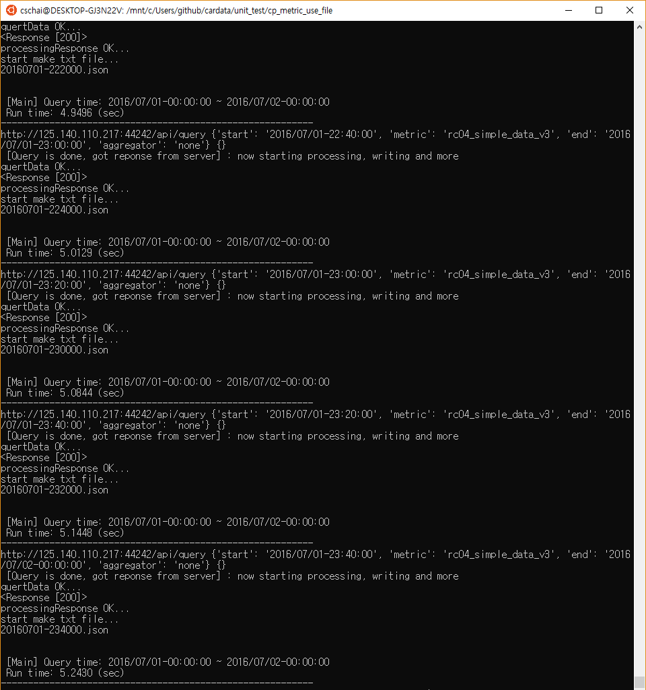
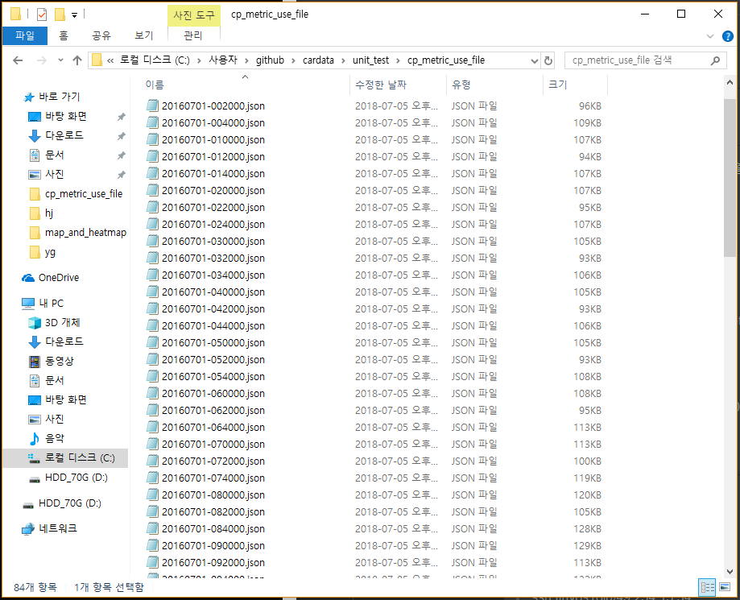
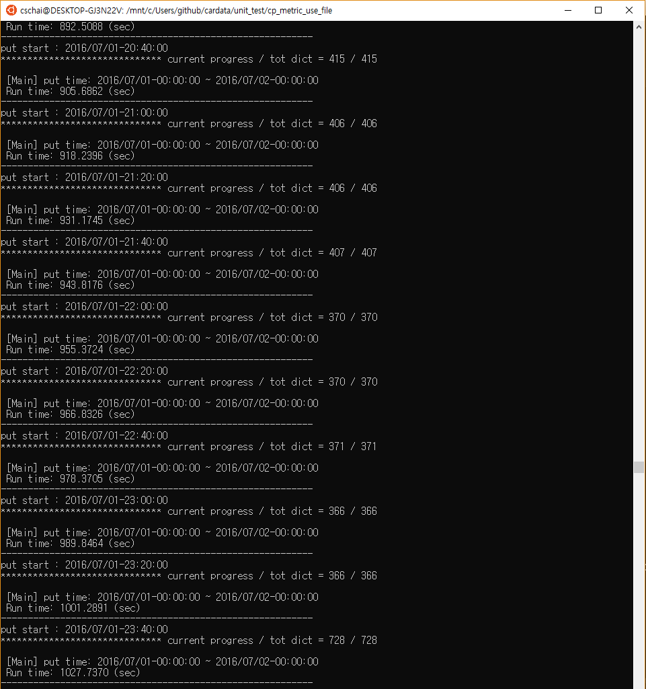
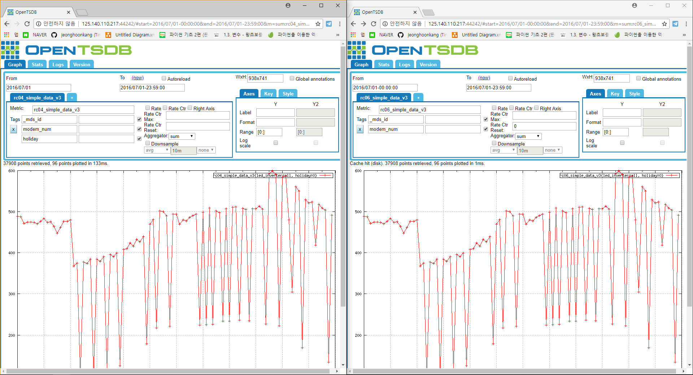

# ◎ 파일을 이용한 메트릭 복사
## ● 설명
○ metric 복사할 때 원본데이터를 query하여 json파일을 만들고 그 json파일을 복사하려고 하는 TSDB에 put한다
 
- query_metric
  > 원본데이터를 query해서 json파일로 저장한다
- put_metric
  > 저장했던 json파일을 열어서 복사하려는 TSDB에 put한다

○ 파일로 저장해서 put하는 장점 : 

- 기존 metric 복사는 일정 시간단위로 쿼리와 put을 순차적으로 수행했다
  
  따라서 코드를 실행하면 원본데이터가 있는 TSDB와 복사하려는 TSDB둘다 느려져 다른 사용자가 작업하기에 느린점이 있었다
  
  query와 put을 따로 함으로써 둘중 한쪽서버는 작업하는데 영향을 받지 않게했다

- query한 데이터가 json파일로 저장되기 때문에 다른 컴퓨터에서 제약없이 put을 할 수 있다

  또한 여러대의 컴퓨터에서 같은 metric에 다른 기간의 json파일을 put할 수 있다 

## ● TEST
 
- query 
  > 데이터 URL : http://125.140.110.217:44242
  >
  > 메트릭 : rc04_simple_data_v3

- put
  > 데이터 URL : http://125.140.110.217:44242
  >
  > 메트릭 : rc06_simple_data_v3

- 기간
  > 2016/07/01-00:00:00 ~ 2016/07/01-23:59:00
----

○ query_metric 

- 실행

  > ./query.sh

- 실행 화면

- json파일 생성

----
○ put_metric

- 실행

  > ./put.sh

- 실행 화면

----

○ openTSDB

- 2016/07/01-00:00:00 ~ 2016/07/01-23:59:00 까지 하루 데이터 복사 결과

- 왼쪽사진 : 원본, 오른쪽사진 : 복사본

> 원본 데이터 : http://125.140.110.217:44242/#start=2016/07/01-00:00:00&end=2016/07/01-23:59:00&m=sum:rc04_simple_data_v3&o=&yrange=%5B0:%5D&wxh=938x741&style=linespoint
 
> 복사 데이터 : http://125.140.110.217:44242/#start=2016/07/01-00:00:00&end=2016/07/01-23:59:00&m=sum:rc06_simple_data_v3&o=&yrange=%5B0:%5D&wxh=938x741&style=linespoint

