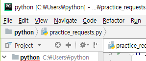
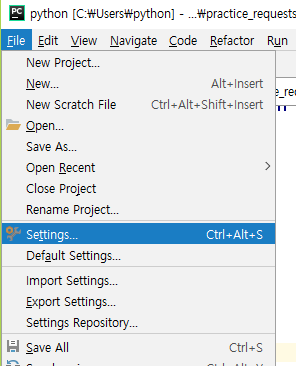
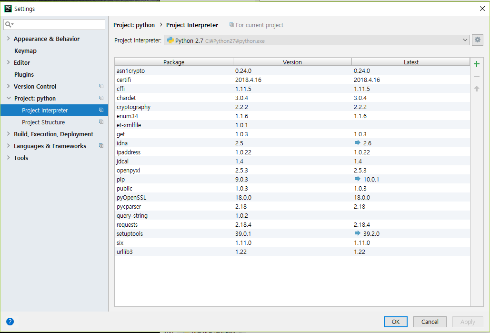
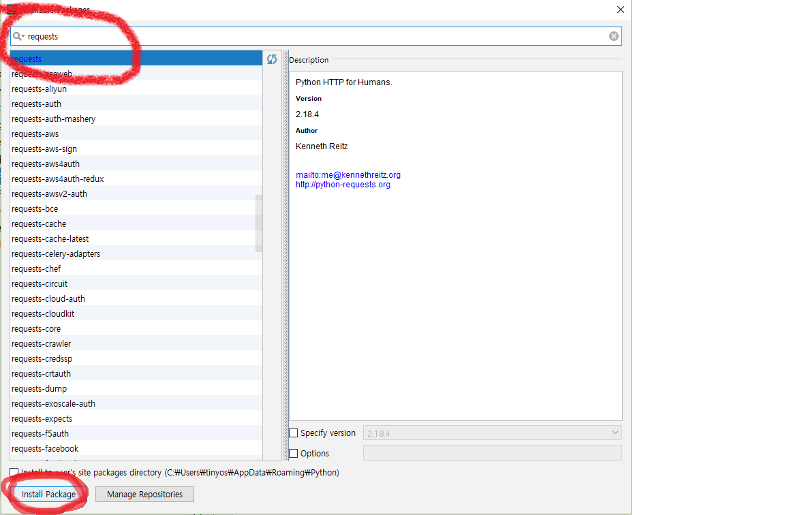
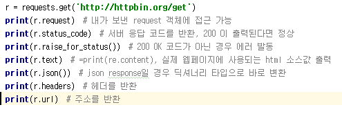
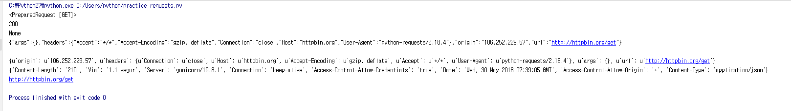

# ◎ requests 모듈
## ● requests HTTP for Humans
- requests는 Python에서 간편하게 HTTP 요청처리를 위해 사용하는 모듈이다.
- 주로 웹 사이트에 html문서를 주고 받는데 쓰인다.
- HTTP는 클라이언트와 서버 사이에 이루어지는 요청,응답 프로토콜이다. 예를 들면, 클라이언트인 웹 브라우저가 HTTP를 통하여 서버로부터 웹페이지나 그림 정보를 요청하면, 서버는 이 요청에 응답하여 필요한 정보를 해당 사용자에게 전달하게 된다.
- 내장모듈이 아니라서 개발자가 따로 설치해줘야 한다.
- HTTP 메소드
> TRACE. PUT, POST, PATCH, OPTIONS, HEAD, GET, DELETE, CONNECT

- 홈페이지
> http://docs.python-requests.org/en/master/ 

- github 홈페이지
> https://github.com/requests
 
----

## ● 설치
### - 윈도우 cmd, 우분투에서 설치
 
    pip install requests
 
### - 파이참에서 설치
 

-왼쪽상단 File에서 settings 클릭

----

-settings 에서 Project: python 밑의 Project Interpreter 누르고 오른쪽 상단에 + 표시 클릭

----

-requests를 검색하여 왼쪽 아래에 Install Package를 눌르면 설치가 된다.

 
----

## ● 기본 사용법
 -먼저 requests 모듈을 사용하기 위해서는 임포트를 해주어야 한다.

    import requests

#### 요청
 -요청하는 방법은 get과 post 두 가지가 있다.

 -get
 
    URL = '웹페이지 주소'
    r = requests.get(URL)
 
 -post
 
    URL = '웹페이지 주소'
    r = requests.post(URL) 

#### 출력

    #내가 보낸 request 객체에 접근 가능
    print(r.request)  
    
   
    #서버 응답 코드를 반환, 200 이 출력된다면 정상
    print(r.status_code)  
    
    
    #200 OK 코드가 아닌 경우 에러 발동
    print(r.raise_for_status())  
    
    
    #실제 웹페이지에 사용되는 html 소스값 출력, = print(re.content)
    print(r.text)  
   
    
    #헤더를 반환
    print(r.headers)
   
   
    #주소를 반환
    print(r.url)

ex)

-실행 코드

-실행 결과

 #### 그 외
 
    r = requests.put(url)
    
    r = requests.delete(url)
    
    r = requests.head(url)
    
    r = requests.options(url)

     
---- 
## ● 파라미터 전송
-웹 서버에 요청을 보낼 때 데이터와 함께 전송할 수도 있다.

1. GET 요청할 때 parameter 전달법
  -

    dic = {'key1': 'value1', 'key2': 'value'}

    r = requests.get(URL, params=dic)

2. POST 요청할 때 data 전달법

  -위의 내용과 같다, params 대신 data라는 이름으로 주면 된다.

    dic = {'key1': 'value1', 'key2': 'value'}

    r = requests.post(URL, data=dic)

3. 헤더 추가, 쿠키 추가

  -별도의 헤더 옵션을 추가하고자 할 때는 headers 옵션을, 쿠키를 심어서 요청을 보내고 싶으면 cookies 옵션을 사용하면 된다

    headers = {'Content-Type': 'application/json; charset=utf-8'}

    cookies = {'session_id': 'sorryidontcare'}

    res = requests.get(URL, headers=headers, cookies=cookies)

참조 : http://zeroplus1.zc.bz/jh/web/main.php?id=173&category=ETC

## ● json
-json(JavaScript Object Notation)은 원래 자바스크립트에서 만들어진 데이터 표현방식으로 최근들어 사용이 부쩍 증가되고 있다. 예전에는 xml방식의 데이터 교환을 많이 했다면 요새는 거의 json으로 하는 추세이다.

-참조 : https://wikidocs.net/15114

-get,post를 데이터와 함께 보낼 때에 간단한 구조이면 상관없지만 복잡한 구조로 요청을 할 때에는 dictionary구조를 유지하면서 문자열로 바꿔서 전달해줘야 하는데 이때 쓰이는게 json이다
    
    # json 임포트
    import json

    r = response.json()	   #응답 본문을 JSON 포맷으로 해석하고 dict형으로 변환하여 반환한다.
    
    print(r.json())   #json response일 경우 딕셔너리 타입으로 바로 변환
    
